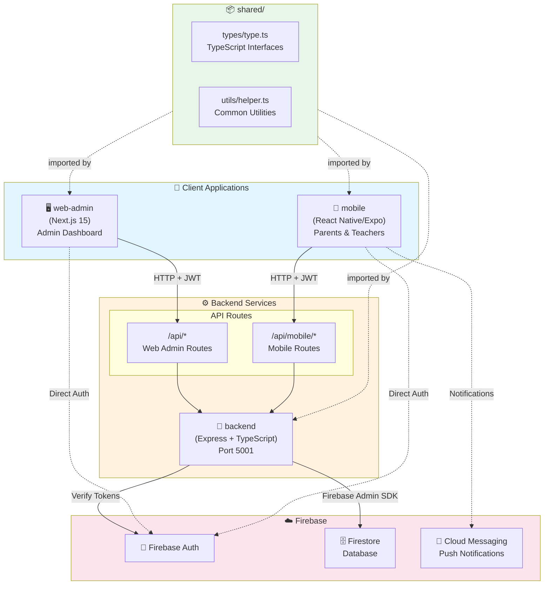
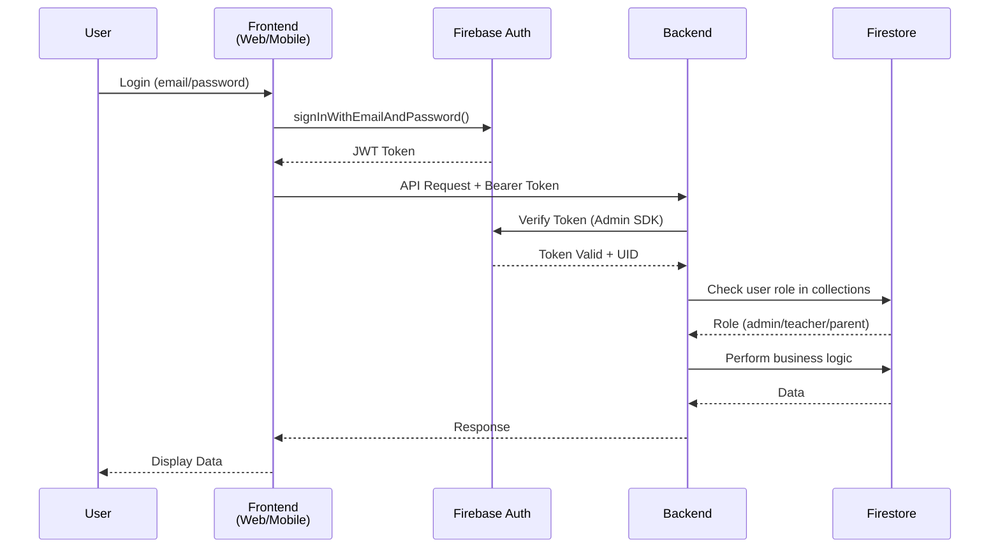
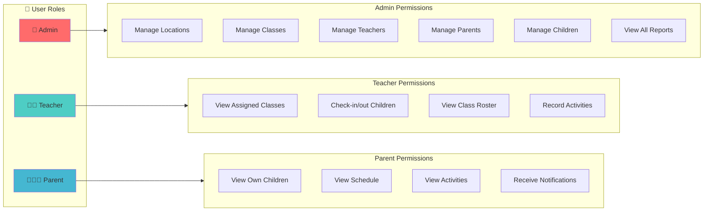

# Sunshine Daycare Management System

## System Architecture



## Authentication Flow



## Data Model

```mermaid
erDiagram
    LOCATION ||--o{ CLASS : contains
    CLASS ||--o{ TEACHER : "assigned to"
    CLASS ||--o{ CHILD : enrolled
    PARENT ||--o{ CHILD : "has"
    CHILD ||--o{ SCHEDULE : "has"
    CLASS ||--o{ SCHEDULE : "defines"
    CHILD ||--o{ ENTRY : "check-in/out"

    LOCATION {
        string id PK
        string name
        string address
    }

    CLASS {
        string id PK
        string name
        string locationId FK
        string[] teacherIds
    }

    TEACHER {
        string id PK
        string email
        string name
        string[] classIds
    }

    PARENT {
        string id PK
        string email
        string name
        string[] childIds
    }

    CHILD {
        string id PK
        string name
        string[] parentIds
        string classId FK
    }

    SCHEDULE {
        string id PK
        string childId FK
        string classId FK
        string dayOfWeek
        time startTime
        time endTime
    }

    ENTRY {
        string id PK
        string childId FK
        timestamp checkIn
        timestamp checkOut
    }
```

## Role-Based Access



---

# Set up the app

## Backend: (Firebase) Node.js / Express / Nest.js backend

mkdir backend && cd backend
npm init -y
npm install firebase-admin
npm install express cors body-parser dotenv
npm install --save-dev typescript ts-node @types/node @types/express nodemon
npx tsc --init

## Mobile: (Parents + Teachers): React Native / Expo app

cd ..
npx create-expo-app@latest mobile

## web-admin (Admin): React / Next.js admin dashboard

npx create-next-app@latest web-admin --typescript

# App structure:

daycare-app/
│
├─ backend/ # Node.js / Express / Nest.js API
│ ├─ src/
│ │ ├─ controllers/ # Handle HTTP requests
│ │ ├─ models/ # Database schemas (ORM or raw SQL
│ │ ├─ routes/ # Define routes & map to controllers
│ │ ├─ services/ # Business logic
| | |\_firebase # Firebase Admin SDK
| | | |\_admin.ts
│ │ └─ server.ts # App entry point
│ ├─ package.json
│ └─ tsconfig.json
│
├─ shared/ # Shared code (Types, API utils) # Shared code (Types + DTOs only)
│ ├─ types/
│ │ ├─ Child.ts
│ │ ├─ Parent.ts
│ │ ├─ Teacher.ts
│ │ └─ Entry.ts
│ ├─ api/
│ │ ├─ client.ts # Axios / fetch wrapper
│ │ └─ endpoints.ts # API paths constants
│ └─ utils/
│ └─ helpers.ts # shared helper functions
│
├─ web-admin/ # Admin Dashboard (React / Next.js)
│ ├─ app/
│ ├─ components/
│ │ ├─ KidsTable.tsx
│ │ ├─ ParentsTable.tsx
│ │ ├─ TeachersTable.tsx
│ │ ├─ ClassesTable.tsx
│ │ └─ ReportGenerator.tsx
│ ├─ hooks/
│ │ └─ useFetchChildren.ts
│ ├─ lib/
│ │ └─ api.ts # Backend API client
| | |\_firebase.ts # Firebase client SDK
│ ├─ package.json
│ └─ tsconfig.json
│
└─ mobile-app/ # Mobile App (React Native / Expo)
├─ app/ # Screens
│ ├─ parent/ # Parent UI
│ │ ├─ ParentHomeScreen.tsx
│ │ ├─ ChildProgressScreen.tsx
│ │ └─ PaymentsScreen.tsx
│ ├─ teacher/ # Teacher UI
│ │ ├─ TeacherHomeScreen.tsx
│ │ ├─ AttendanceScreen.tsx
│ │ └─ ReportsScreen.tsx
│ └─ auth/
│ ├─ SignIn.tsx
├─ components/
│ ├─ EntryCard.tsx
│ └─ ChildCard.tsx
├─ hooks/
│ └─ useChildren.ts
│ ├─ lib/
│ │ └─ api.ts # Backend API client
| | |\_firebase.ts # Firebase client SDK
├─ navigation/
│ ├─ ParentNavigator.tsx
│ ├─ TeacherNavigator.tsx
│ └─ RootNavigator.tsx # decides which navigator to show based on role
├─ package.json
└─ tsconfig.json

## Work flow is:

### Option C: Hybrid (common in real apps)

Backend handles the “source of truth” (registering users, storing daycare entries, etc.).

- Frontend still uses Firebase SDK for specific features:

- Firebase Authentication (login with Google/Apple/etc.)

- Firebase Cloud Messaging (push notifications)

- Firebase Analytics

👉 In this setup, the backend trusts Firebase tokens and handles database + business logic.
👉 The frontend talks to Firebase only for auth + notifications, but all daycare business data flows through the backend.

### For this option:

Backend: owns all business logic, database, and talks to Firebase for things like storing children’s data, attendance, reports, etc.

Keep auth + push notifications direct with Firebase on the frontend.

Use shared/ only for types, DTOs, and API constants, not for Firebase configs.

Frontend (mobile + web-admin):

- Talks to backend API for daycare features.

- Talks to Firebase directly only for:

- Authentication (login/signup)

- Push notifications

- Analytics

This way:

Backend is the gatekeeper.

Mobile & web-admin stay light, but still use Firebase features that only make sense on the client.

We can swap Firebase out in the future if needed.

# Flow Example

Parent logs in → Frontend uses Firebase Auth (signInWithEmailAndPassword).

Firebase returns a token → Frontend sends that token in API requests to backend (Authorization: Bearer <token>).

Backend verifies token with Firebase Admin SDK → then performs daycare logic (saving parent, child, etc.).

Frontend shows data returned by backend.

## Note: Clear cached route types

Stop Metro bundler (Ctrl+C).

Run:

rm -rf .expo
yarn start

# Logic Flow

admin create collection of teacher and and parent
when teacher / parent register (for their choosen password), backend checking for matching email in collections,

- only matching email will be registed
- after matching: if in parent collection => set custom claim role is parent. Same check with admin and teacher
- Update data doc of each user with UID

- when they login: check against custom claim role with UID
